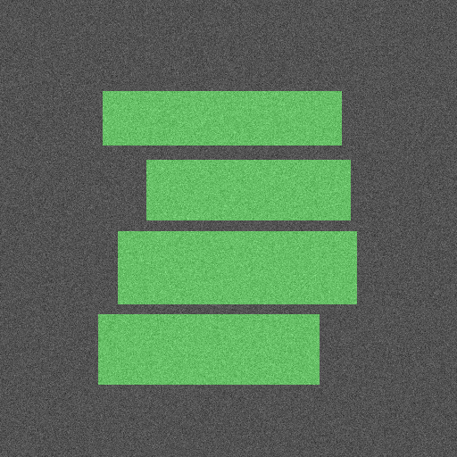

# EADC-Net (Code-Only Release)

End-to-end pipeline for lumbar spine **ROI segmentation** + **vertebra detection** on X-rays.  
Code only, no medical images, labels, or weights (privacy / licensing).  
For testing, a small **synthetic generator** is included so you can run the full pipeline.

---

## Project layout
src/ core code (seg/det loaders, collate, utils)
models/ UNet-like seg, torchvision Faster R-CNN det
utils/ augment, metrics (Dice/HD95/AUPRC/ECE), Grad-CAM
losses.py loss funcs
configs/ YAML configs
tools/ toy data gen + small scripts
train.py training loop
eval.py eval loop
requirements.txt

---

## Install
```bash
conda create -n eadcnet python=3.10 -y
conda activate eadcnet
pip install -r requirements.txt
GPU recommended, but CPU works for toy runs.

Data
Two options:

A. Toy data (quick start)
python tools/make_synthetic_toy.py --out data --num 40 --img-size 512

Creates:
data/
  seg/images + seg/masks
  det/images + det/labels.csv (or YOLO .txt)

B. Own data (if you have anonymized X-rays)
Follow the same folder layout as above.

Training
Seg:
python train.py --task seg --config configs/segmentation.yaml

Det:
python train.py --task det --config configs/detection.yaml

Supports K-fold (set in YAML).

Evaluation
Seg:
python eval.py --task seg --config configs/segmentation.yaml --ckpt runs/seg/best.pt

Det:
python eval.py --task det --config configs/detection.yaml --ckpt runs/det/best.pt --score-thr 0.05

Outputs:
Seg → Dice (main metric)
Det → val loss + mAP@0.5

Curves + overlays → runs/<task>/
Quick check: tools/vis_det_debug.py (for detection) or overlay PNGs (for seg).
```

## Viz
Loss curves + overlays auto-saved under runs/
Grad-CAM helpers in src/utils/gradcam.py

## Notes
Loss: BCE + Dice (weights in YAML)
Metrics: Dice / AUPRC / HD95 / ECE
Augmentation: flips + small intensity jitter
Class imbalance (det): single class → sampler exists but rarely needed
Reproducibility: fixed seeds everywhere (also toy gen)

Toy run (~40 imgs, 10 epochs) → Dice ~0.72.
Not fancy — edges are messy early but improve with training.

## Example
Synthetic overlay (green = mask, gray = input):


 
