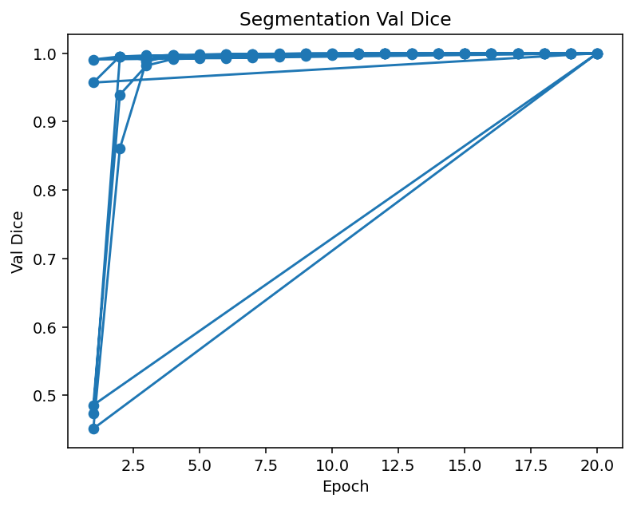
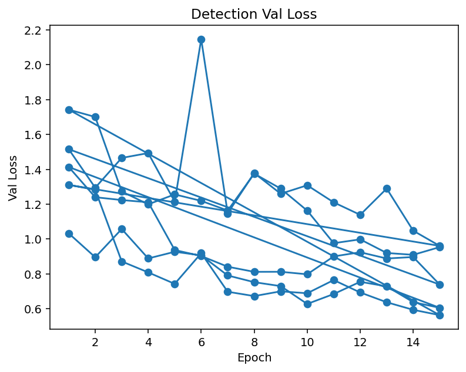

# EADC-Net (Public Code-Only Release)
End-to-end pipeline for lumbar spine **ROI segmentation** and **vertebra detection** on X-ray images.

This repository is **code-only**: no medical images, labels or weights are included due to privacy and licensing.
For full reproducibility, I provide a small **synthetic** dataset generator so anyone can train/evaluate end-to-end without real data.

---

## Project structure

src/
data/ # dataset loaders (seg/det) and collate
models/ # UNet-like segmentation, torchvision Faster R-CNN detection
utils/ # augmentations, metrics (Dice/HD95/AUPRC/ECE), Grad-CAM helpers
losses.py
configs/
segmentation.yaml
detection.yaml
tools/
make_synthetic_toy.py # create tiny non-PHI dataset
normalize_seg_filenames.py # housekeeping utils
check_pairs.py
vis_det_debug.py
train.py
eval.py
requirements.txt

---

## Installation

```bash
conda create -n eadcnet python=3.10 -y
conda activate eadcnet
pip install -r requirements.txt
GPU is recommended but CPU works for the toy runs.

---

Data (two options)
A) Generate synthetic toy data (recommended for quick start)
python tools/make_synthetic_toy.py --out data --num 40 --img-size 512
This creates:
data/
  seg/
    images/*.png
    masks/*.png
  det/
    images/*.png
    labels.csv
    labels/*.txt

B) Use your own anonymized data
Match the same layout: for segmentation use seg/images + seg/masks (same file names),
for detection use det/images + det/labels.csv (or YOLO det/labels/*.txt).

```

## Training
Segmentation
python train.py --task seg --config configs/segmentation.yaml

Detection
python train.py --task det --config configs/detection.yaml
Both tasks support K-fold (configured in YAML).

---

## Evaluation
Segmentation
python eval.py --task seg --config configs/segmentation.yaml --ckpt runs/seg/best.pt

Detection
python eval.py --task det --config configs/detection.yaml --ckpt runs/det/best.pt --score-thr 0.05
Reports Dice/HD95/AUPRC/ECE for segmentation, and val loss + mAP@0.5 for detection.

---

## Visualizations
-Loss curves and qualitative overlays are saved under runs/<task>/
-tools/vis_det_debug.py overlays detection results for quick inspection.
-Grad-CAM utilities are available under src/utils/gradcam.py.

---

## Key technical choices
-Losses (seg): BCE + Dice (weights in YAML).
-Metrics: Dice / AUPRC / HD95 / ECE.
-Augmentation: conservative geometric + intensity jitters via utils/augment.py.
-Class imbalance (det): single-class with loss-driven training; sampler/weighting can be enabled if needed.
-Reproducibility: fixed seeds in YAML; synthetic generator also uses deterministic seeds.

---

## Training Curves

Segmentation (Dice validation per epoch):


Detection (Validation loss per epoch):



### Example Segmentation Output
Example overlay on synthetic toy data (green = predicted mask, gray = input X-ray):


On the toy dataset (~40 images), training for 10 epochs yields Dice ≈ 0.72. 
Boundary artifacts are common at early epochs but reduce with longer training. 